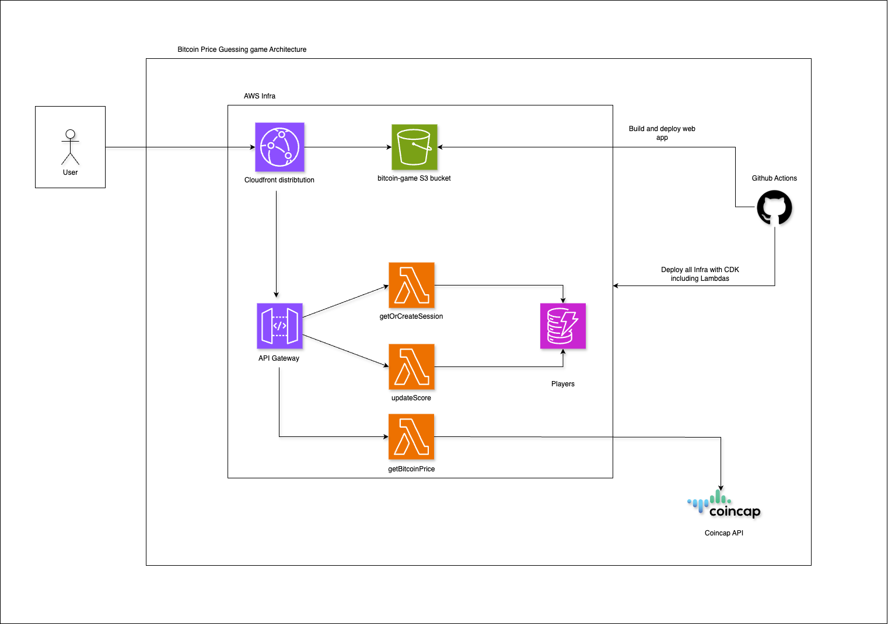

# Bitcoin game

## Game Rules

- The player can at all times see their current score and the latest available BTC price in USD
- The player can choose to enter a guess of either “up” or “down“
- After a guess is entered the player cannot make new guesses until the existing guess is resolved
- The guess is resolved when the price changes and at least 60 seconds have passed since the guess was made
- If the guess is correct (up = price went higher, down = price went lower), the user gets 1 point added to their score. If the guess is incorrect, the user
  loses 1 point.
- Players can only make one guess at a time
- New players start with a score of 0

## Architecture

## How to run locally

### Prerequisites

#### Node version

This project uses [NVM](https://github.com/nvm-sh/nvm) (Node Version Manager) to automatically use **Node.js version 22.14.0**.

#### Installing dependencies

`npm install`

### Running dev server

`npm run dev`

This command starts a development server for the frontend app, using a mock server to handle requests.

## Deployments

This app uses a Continuous Deployment workflow powered by GitHub Actions. On every commit pushed to the repository, GitHub Actions will trigger a deployment to
AWS. The deployment process currently includes:

- **Infrastructure deployment**: Provisions AWS resources such as the S3 bucket, CloudFront distribution, etc.
- **Frontend deployment**: Builds the frontend app and uploads it to the S3 bucket.

To deploy on your own AWS account, simply fork this repository and add the required GitHub Action secrets:

## Useful commands

- `npm test` run tests for all workspaces
- `npm run test --workspace <WORKSPACE>` run tests for especific `<WORKSPACE>`
- `npx prettier --write .` format the whole project
